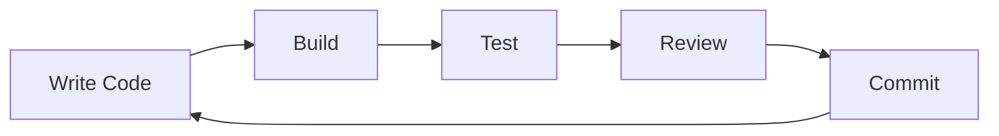

# Workflows

## Development Cycle



## Daily Workflow

### Start of Day

```bash
git checkout main
git pull origin main
git checkout -b feature/my-feature
```

### During Development

```bash
# Make changes, then...
dotnet build
dotnet test
git add .
git commit -m "feat: description"
```

### End of Day

```bash
git push origin feature/my-feature
# Create PR on GitHub
```

## Build Commands

```bash
# Development build
dotnet build

# Release build
dotnet build -c Release

# Watch mode (auto-rebuild on changes)
dotnet watch --project GameStore.Api

# Clean build artifacts
dotnet clean
```

## Code Quality

### Formatting

```bash
# Format code
dotnet format

# Check formatting
dotnet format --verify-no-changes
```

### Static Analysis

```bash
# Run analyzers
dotnet build
```

### Dependency Analysis

```bash
# Check for outdated packages
dotnet list package --outdated
```

## Database Migrations

### Create Migration

```bash
dotnet ef migrations add <MigrationName> --project Infrastructure --startup-project GameStore.Api
```

### Apply Migrations

```bash
# Applied automatically on startup (in Development)
# Manual apply:
dotnet ef database update --project Infrastructure --startup-project GameStore.Api
```

### Remove Last Migration

```bash
dotnet ef migrations remove --project Infrastructure --startup-project GameStore.Api
```

## Release Process

1. Update version in project file
2. Create release branch: `git checkout -b release/v1.0.0`
3. Update changelog
4. Build release: `dotnet build -c Release`
5. Run tests: `dotnet test -c Release`
6. Create GitHub release
